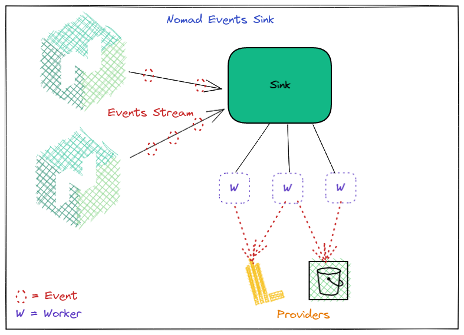

<a href="https://zerodha.tech"></a>

# Nomad Events Sink



Nomad Events Sink is an events collection agent which uses [Nomad Events SDK](https://www.nomadproject.io/api-docs/events) to fetch events.

Events can help debug the cluster state and alert operators about new deployments, failing allocations, node updates etc. Nomad emits these events in a channel and provides an SDK to access these events.

The missing piece was a tool to ingest these events and analyze/visualize them later. This is where `nomad-events-sink` agent comes into picture and helps to ingest these events in multiple configurable **Sinks**.

The tool is designed to be generic in order to handle many use-cases of processing events. Multiple [Sink Providers](./internal/sinks/provider/provider.go) can be created and events will be handled by them. Common usecases included storing events for long term use (Vector->Loki), alerting on cluster state changes (Slack/Rocketchat webhooks) etc.

## How does it work?

- A subscription for each topic is created and new events are watched.
- Whenever a new event comes, it gets added to a `Sink` channel.
- Multiple background workers (Goroutines) are listening to this channel, processing events in FIFO.
- These workers batch events and push to upstream providers (for eg HTTP/S3 etc).
- A background worker commits the event index state to a file on disk. This is done so that the program is able to pickup events from where it left before shutting down.

### Batching Events

This program uses 2 batch strategies in order to avoid an inefficient process of making a request for every incoming event:

- `idle_timeout`: If a batch is in memory for more than `idle_timeout` duration, it is flushed to providers.
- `events_count`: If a batch has more events than `events_counts`, it is flushed to providers.

## Deploy

You can choose one of the various deployment options:

### Nomad

To deploy on a Nomad cluster, you can refer to [this jobspec](./deploy/job.nomad).

### Binary

Grab the latest release from [Releases](https://github.com/mr-karan/nomad-events-sink/releases).

To run:

```
$ ./nomad-events-sink.bin --config config.toml
```

### Docker

```
docker pull ghcr.io/mr-karan/nomad-events-sink:latest
```

### Quick Start

Refer to [this example](./examples/README.md) for quickly getting started with ingesting Deployment Events to Loki using Vector.


## Configuration

Refer to `config.sample.toml` for a list of configurable values.

### Environment Variables

All config variables can also be populated as env vairables by prefixing `NOMAD_EVENTS_SINK_` and replacing `.` with `__`.

For eg: `app.data_dir` becomes `NOMAD_EVENTS_SINK_app__data_dir`.

Nomad API client reads the following environment variables:

- `NOMAD_TOKEN`
- `NOMAD_ADDR`
- `NOMAD_REGION`
- `NOMAD_NAMESPACE`
- `NOMAD_HTTP_AUTH`
- `NOMAD_CACERT`
- `NOMAD_CAPATH`
- `NOMAD_CLIENT_CERT`
- `NOMAD_CLIENT_KEY`
- `NOMAD_TLS_SERVER_NAME`
- `NOMAD_SKIP_VERIFY`

You can read about them in detail [here](https://www.nomadproject.io/docs/runtime/environment).

## Sink Providers

- Currently only **HTTP** Provider is implemented. There's a full [working example](./examples/README.md) of ingesting events to the HTTP server provided by Vector and dumping them to Loki.

## Contribution

Please feel free to open a new issue for bugs, new features (like Sink Providers), feedback etc.

## LICENSE

[LICENSE](./LICENSE)
