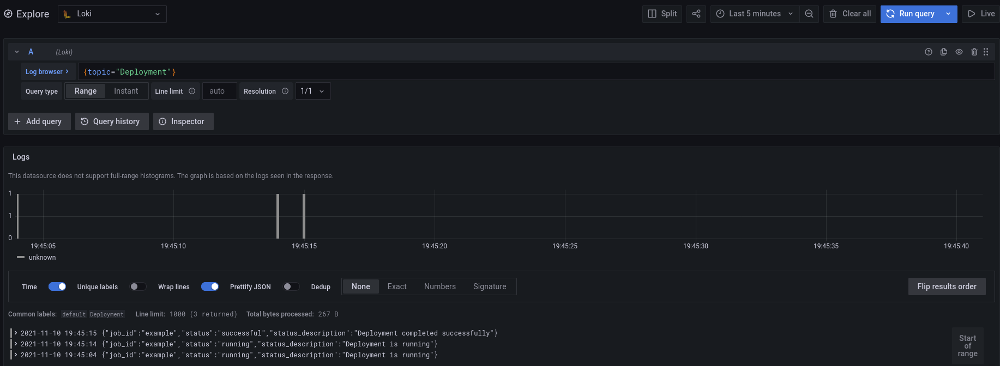

# Ingest Nomad events in Loki

## Setup Nomad

```
$ nomad agent -bind 0.0.0.0 -dev
```

## Setup Vector

```
$ vector -c ./examples/vector.toml
```

## Setup Loki/Grafana

```
docker-compose up
```

## Deploy a Redis Job

```
$ nomad job init
$ nomad run example.nomad
```

## View Deployment Events on Grafana Loki


